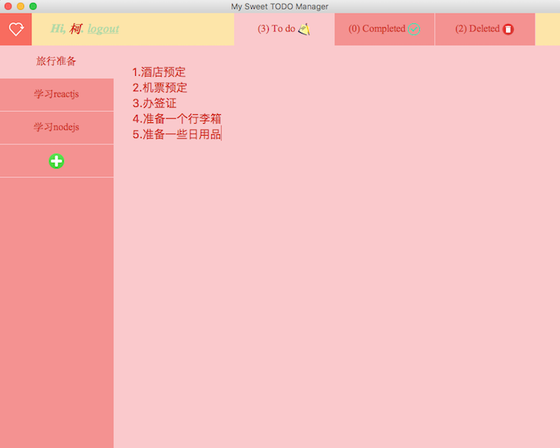

# 记事本 
🌲这是一个用node-webkit + vue2 + koa2 + mongodb开发的，可以实时编辑保存的桌面记事本。该项目分为两部分：桌面客户端(node-webkit) + 服务端(koa2)。🚀
## 效果


## 源码地址
https://github.com/hu-ke/nw-todo-app

## 技术栈
vue2 + node-webkit + koa2 + mongodb

## 数据存储
数据存储由用户登录状态决定。若用户已登录，数据存储在远程服务器；用户未登录时，数据存储在localStorage。

## 项目结构
```
|-- nw-todo-app
| |-- client                // 客户端
|   |-- assets              // 各种静态资源 
|     |-- css               // 样式资源
|     |-- images            // 图片资源
|     |-- js                // js资源
|       |-- data.js         // 定义的数据存储结构
|       |-- fetch.js        // api请求文件
|       |-- index.js        // 业务逻辑文件
|       |-- taskManager.js  // 操作任务的一些方法
|       |-- vue.min.js      // 依赖的vue库
|   |-- TodoManager.app     // 应用文件(可以直接打开)
|   |-- app-screenshot.png  // 效果图
|   |-- index.html          // 页面
|   |-- package.json        // 配置文件
|   |-- README.md           // client说明文档
| |-- server                // 服务端
|   |-- controllers         // 控制器
|     |-- index.js
|     |-- tasks.js          // 任务管理
|     |-- users.js          // 用户管理
|   |-- global              // 全局配置
|   |-- middlewares         // 中间件
|   |-- models
|     |-- tasks.js          // 任务模型
|     |-- users.js          // 用户模型
|   |-- test
|     |-- api.test.js       // 接口测试文件
|   |-- utils
|     |-- index.js          // 工具方法
|   |-- .babelrc            // ES6语法编译配置
|   |-- .eslintrc           // 代码规范
|   |-- package.json        // 项目及工具的依赖配置文件
|   |-- server.js           // 服务启动入口
|   |-- README.md           // server说明文档
| |-- README.md             // 说明文档
```

## 客户端
### 运行
你可以像打开一般Mac应用一样，直接打开TodoManager.app文件运行。

### 开发
```
TodoManager.app/Contents/MacOS/node-webkit .
```

## 服务端
### 部署
服务端已经部署在我自己的服务器上，不需要你进行部署啦。
当然如果你希望将服务端部署在你自己的服务器上，你需要：
>1.安装mongodb <br/>
2.将`client/js/fetch.js`中的baseUrl改为你自己的服务器地址。<br/>
3.启动node服务。
### 安装依赖
```
npm install
```
### 启动
```
npm start
```
### 测试
```
npm test
```


## 功能
- [x] 注册登录
- [x] 本地/服务端存储数据
- [x] 实时编辑
- [x] 重命名任务
- [x] 添加/删除一个任务
- [x] 改变任务状态

## 展示
### 注册登录


### 编辑


## 补充说明
本项目实现的功能比较简单。由于我之前没有写过node服务和node-webkit桌面应用，所以本项目算是对这两者的一次窥探和尝试吧。项目当中若存在的不足之处还望指正。有什么好的建议也可以提哈~


